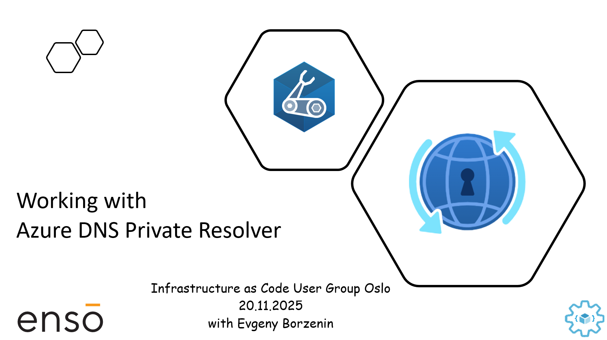

# Working with Azure DNS Private Resolver

This is level 200 workshop that covers different aspects of working with [Azure DNS Private Resolver](https://learn.microsoft.com/en-us/azure/dns/dns-private-resolver-overview) where you will learn:

- What is Azure DNS Private Resolver
- TODO 

and much more...

Workshop is organized as a combination of theoretical blocks with slides and hand-on labs. Estimated time for workshop completion is between 3 and 4 hours.

## Agenda

- Welcome + practical information
- Azure DNS Private Resolver overview (slides)
- [Lab-01](labs/lab-01/index.md) - Provision lab resources
- [Lab-07](labs/lab-07/index.md) - Cleaning up resources

## Prerequisites

Please spend some time before the workshop and make sure that you have installed/registered/configured all [prerequisites](./prerequisites.md).